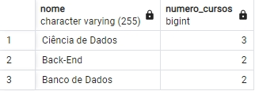

# PostgreSQL: Views, Sub-Consultas e Funções

Praticando o uso do SQL e relacionamentos; usando tipos diferentes de chaves estrangeiras; como escrever e executar sub-consultas; usando funções para trabalhar com strings, data e fórmulas; e gerando uma view baseado no comando SELECT.

1. [Chaves estrangeiras e Tipos](#1-chaves-estrangeiras-e-tipos)
2. [Praticando comandos](#2-praticando-comandos)
3. [Executando Sub-consultas](#3-executando-sub-consultas)
4. [Usando funções](#4--usando-funções)
5. [Criando views](#5-criando-views)

Saiba mais sobre o curso [aqui](https://cursos.alura.com.br/course/postgresql-views-sub-consultas-funcoes) ou acompanhe minhas anotações abaixo. ⬇️

## 1. Chaves estrangeiras e Tipos

### **Chaves estrangeiras**

As chaves estrangeiras são definidas para referenciar um campo que está relacionado com outra tabela do banco.

> Chave estrangeira (foreign key) é o campo que estabelece o relacionamento entre duas tabelas. Uma chave estrangeira sempre faz a referência entre o campo de uma tabela com um campo de outra tabela.

```sql
CREATE TABLE aluno_curso (
	aluno_id INTEGER NOT NULL,
	curso_id INTEGER NOT NULL,
	PRIMARY KEY (aluno_id, curso_id),
	
	FOREIGN KEY (aluno_id) REFERENCES aluno (id),
	FOREIGN KEY (curso_id) REFERENCES curso (id)
);

-- Outra forma de definir as chaves estrangeiras
CREATE TABLE aluno_curso (
	aluno_id INTEGER NOT NULL REFERENCES aluno(id),
	curso_id INTEGER NOT NULL REFERENCES curso(id),
	PRIMARY KEY (aluno_id, curso_id)
);
```

Excluindo e recriando todas as tabelas para adicionar a tabela de categoria e referenciar ela na tabela curso.

```sql
DROP TABLE aluno_curso, aluno, curso;

CREATE TABLE categoria (
	id SERIAL PRIMARY KEY,
	nome VARCHAR(255) NOT NULL
);

CREATE TABLE curso (
	id SERIAL PRIMARY KEY,
	nome VARCHAR(255) NOT NULL,
	categoria_id INTEGER NOT NULL REFERENCES categoria(id)
);

CREATE TABLE aluno (
	id SERIAL PRIMARY KEY,
	primeiro_nome VARCHAR(255) NOT NULL,
	ultimo_nome VARCHAR(255) NOT NULL,
	data_nascimento DATE NOT NULL
);

CREATE TABLE aluno_curso (
	aluno_id INTEGER NOT NULL REFERENCES aluno(id),
	curso_id INTEGER NOT NULL REFERENCES curso(id)
);
```

Para saber mais sobre relacionamentos, basta ver [este](/Para%20saber%20mais/Aula%201%20-%20Atividade%207%20Para%20saber%20mais_%20Relacionamentos.pdf) arquivo e acessar o link complementar dele.

## 2. Praticando comandos

Após criar as tabelas é preciso inserir registros nelas para se realizar as consultas e filtros de dados. Dando a devida atenção aos campos que foram inseridos e suas definições, seja `SERIAL`, `VARCHAR`, `DATE` ou outros.

```sql
INSERT INTO aluno
	(primeiro_nome, ultimo_nome, data_nascimento)
VALUES
	('Vinicius', 'Dias', '1997-10-15'),
	('Patricia', 'Freitas', '1986-10-25'),
	('Diogo', 'Oliveira', '1984-08-27'),
	('Maria', 'Rosa', '1985-01-01');

INSERT INTO categoria (nome)
VALUES ('Front-End'), ('Back-End'), ('Banco de Dados'), ('Ciência de Dados');

INSERT INTO curso
	(nome, categoria_id)
VALUES
	('HTML', 1),
	('CSS', 1),
	('JavaScript', 1),
	('PHP', 2),
	('Java', 2),
	('C++', 2),
	('PostgreSQL', 3),
	('MySQL', 3),
	('Oracle', 3),
	('SQL Server', 3),
	('SQLite', 3),
	('Pandas', 4),
	('Machine Learning', 4),
	('Power BI', 4);

INSERT INTO aluno_curso VALUES (1,4), (1,11), (2,1), (2,2), (3,4), (3,3), (4,4), (4,6), (4,5);
```

### **Alunos em mais cursos**

Para realizar uma consulta é preciso ter em mente que resultado se quer obter dos registros existentes. Ao realizar uma consulta com todos os registros, alguns dados podem não ser necessários e/ou podem vir repetidos. Ao inserir filtros, agrupamento e ordenamento se obtém resultados mais precisos e limpos.

```sql
-- Puxa todos os registros de todas as tabelas
SELECT * FROM aluno
JOIN aluno_curso ON aluno_curso.aluno_id = aluno.id
JOIN curso ON curso.id = aluno_curso.curso_id

-- Puxa apenas nome, sobrenome e quantidade de cursos agrupados em ordem descendente de quantidade
SELECT
	aluno.primeiro_nome,
	aluno.ultimo_nome,
	COUNT(curso.id) numero_cursos
FROM aluno
JOIN aluno_curso ON aluno_curso.aluno_id = aluno.id
JOIN curso ON curso.id = aluno_curso.curso_id
GROUP BY 1, 2
ORDER BY numero_cursos DESC;

-- Puxa os mesmo registros de antes, sem a necessidade de junção com a tabela dos cursos
SELECT
	aluno.primeiro_nome,
	aluno.ultimo_nome,
	COUNT(aluno_curso.curso_id) numero_cursos
FROM aluno
JOIN aluno_curso ON aluno_curso.aluno_id = aluno.id
GROUP BY 1, 2
ORDER BY numero_cursos DESC;
```

### **Cursos mais requisitados**

Para obter o top 3 cursos mais requisitados, além de contar o número de alunos em cada curso, é preciso limitar o resultado obtido na consulta, ordenado de forma descendente.

```sql
SELECT
	curso.nome,
	COUNT(aluno_curso.aluno_id) numero_alunos
FROM curso
JOIN aluno_curso ON aluno_curso.aluno_id = curso.id
GROUP BY 1
ORDER BY numero_alunos DESC
LIMIT 3;
```


O mesmo serve para a categoria.

> O ideal é sempre começar pela tabela que possui a informação central do relatório, e a partir dela ir fazendo todos os relacionamentos com os JOINs corretos.

```sql
SELECT
	categoria.nome,
	COUNT(aluno_curso.curso_id) numero_cursos
FROM categoria
JOIN aluno_curso ON aluno_curso.aluno_id = categoria.id
GROUP BY 1
ORDER BY numero_cursos DESC
LIMIT 3;
```



## 3. Executando Sub-consultas

### **Operador IN**

O operador `IN` funciona como o igual, mas ele recebe mais valores a serem comparados. Ele substitui o `OR` fazendo um loop do que se pede. No caso abaixo, ele vai buscar os cursos das categorias 1 e 2, ou seja, o que está em 1 e 2.

```sql
-- Trazendo os cursos das categorias com o operador igual
SELECT * FROM curso WHERE categoria_id = 1;
SELECT * FROM curso WHERE categoria_id = 2;

-- Trazendo os cursos das categorias com o operador ou
SELECT * FROM curso WHERE categoria_id = 1 OR categoria_id = 2;

-- Trazendo os cursos das categorias com o operador em
SELECT * FROM curso WHERE categoria_id IN (1, 2);
```

### **Queries aninhadas**

Queries aninhadas são consultas dentro de outras consultas que realizam algo a mais necessário ao resultado. Também chamadas de subconsultas, precisam estar dentro de um parênteses e funcionam como um filtro adicional.

```sql
-- Traz os cursos em que o nome da categoria não possui espaço
SELECT * FROM curso WHERE categoria_id IN (
	SELECT id FROM categoria WHERE nome NOT LIKE '% %'
);

-- Traz o nome dos cursos em que a categoria não possui espaço
SELECT curso.nome FROM curso WHERE categoria_id IN (
	SELECT id FROM categoria WHERE nome NOT LIKE '% %'
);

-- Traz o nome dos cursos em que a categoria possui "de" entre espaços
SELECT curso.nome FROM curso WHERE categoria_id IN (
	SELECT id FROM categoria WHERE nome LIKE '% de %'
);
```

### **Personalizando tabela**

As duas consultas abaixo trazem o mesmo resultado, mas em alguns casos será necessário utilizar a subconsulta.

```sql
SELECT
	categoria.nome AS categoria,
	COUNT(curso.id) AS numero_cursos
FROM categoria
JOIN curso ON curso.categoria_id = categoria.id
GROUP BY categoria
HAVING COUNT(curso.id) > 3;


SELECT
	categoria,
	numero_cursos
FROM (
	SELECT
		categoria.nome AS categoria,
		COUNT(curso.id) AS numero_cursos
	FROM categoria
	JOIN curso ON curso.categoria_id = categoria.id
	GROUP BY categoria
) AS categoria_cursos
WHERE numero_cursos > 3;
```

Para saber mais sobre a clásula `HAVING` em comparação com subconsultas, veja [essa](https://stackoverflow.com/questions/12943960/having-clause-vs-subquery) resposta.

## 4.  Usando funções

### **Funções de strings**

As funções de string formatam textos para que sejam exibidos, mesmo sem ser alterados nos registros.

- `CONCAT` Junta os campos de duas ou mais colunas
- `UPPER` Deixa todo o texto com letra maiúscula
- `TRIM` Remove todos os espaços em branco

```sql
SELECT (primeiro_nome || ' ' || ultimo_nome) AS nome_completo FROM aluno;
SELECT CONCAT(primeiro_nome, ' ', ultimo_nome) AS nome_completo FROM aluno;
SELECT UPPER(CONCAT(primeiro_nome, ' ', ultimo_nome)) AS nome_completo FROM aluno;
SELECT TRIM(UPPER(CONCAT(primeiro_nome, NULL, ultimo_nome) || ' ')) AS nome_completo FROM aluno;
```

Outras funções do formatação podem ser vistas [aqui](https://www.postgresql.org/docs/9.1/functions-string.html).

### **Funções de data**

As funções de data calculam o tempo que se quer obter como resultado na consulta.

- `NOW()::DATE` retorna a data atual
- `AGE()` retorna a idade baseada na data atual, subtraindo do campo que contém a data de nascimento
- `EXTRACT(YEAR FROM AGE())` extrai apenas o ano do cálculo feito pelo age, que antes trazia até as horas

```sql
SELECT
	(primeiro_nome || ' ' || ultimo_nome) AS nome_completo,
	(NOW()::DATE - data_nascimento) / 365 AS idade
FROM aluno;


SELECT
	(primeiro_nome || ' ' || ultimo_nome) AS nome_completo,
	AGE(data_nascimento) AS idade
FROM aluno;


SELECT
	(primeiro_nome || ' ' || ultimo_nome) AS nome_completo,
	EXTRACT(YEAR FROM AGE(data_nascimento)) AS idade
FROM aluno;
```

Outras funções de data podem ser vistas [aqui](https://www.postgresql.org/docs/9.1/functions-datetime.html).

### **Funções matemáticas**

Existem funções matemáticas para realizar cálculos nas consultas e elas podem ser realizadas pelas funções próprias do PostgreSQL ou através de operadores. Alguns exemplos e o que fazem:

- `abs()` valor absoluto
- `cbrt()` raiz cúbica
- `sqrt()` raiz quadrada
- `round` arredondamento
- `degrees()` radianos para graus
- `radians()` graus para radianos
- `div(x, y)` divisão inteira
- `exp()` exponenciação
- `pi()` valor de pi (π)

Operador | Descrição	  | Exemplo	  | Resultado
-------- | -------------- | --------- | ---------
`+`		 | adição		  | 2 + 3	  | 5
`-`		 | subtração	  | 2 - 3	  | -1
`*`		 | multiplicação  | 2 * 3	  | 6
`/`		 | divisão		  | 4 / 2	  | 2
`%`		 | módulo (resto) | 5 % 4	  | 1
`^`		 | exponenciação  | 2.0 ^ 3.0 | 8
`@`		 | valor absoluto | @ -5.0	  | 5
`&`		 | AND			  | 91 & 15	  | 11
`~`		 | NOT			  | ~1		  | -2

Outras funções de operações podem ser vistas [aqui](https://www.postgresql.org/docs/9.5/functions-math.html).

### **Conversão de dados**

A conversão de dados é útil para trabalhar com vários tipo de dados. Formatando datas em strings, por exemplo. A convenção é que o primeiro argumento seja o valor a ser formatado e o segundo argumento seja o modelo que define o formado de saída ou entrada do dado.

```sql
-- Data atual no formato americano
SELECT NOW()::DATE;

-- Data atual no formato brasileiro
SELECT TO_CHAR(NOW(), 'DD/MM/YYYY');
```

Outras funções de conversão podem ser vistas [aqui](https://www.postgresql.org/docs/9.5/functions-formatting.html) e todas as demais funções do PostgreSQL podem ser vistas [aqui](https://www.postgresql.org/docs/current/functions.html).

## 5. Criando views

Em resumo, a `VIEW` é uma tabela virtual que serve para nomear consultas de relatórios e acessar mais facilmente os registros. Inclusive, torna mais simples o compartilhamento das consultas, pois ganha legibilidade e segurança.

> O conceito de nomear consultas, utilizando tabelas virtuais a partir de um nome atribuído a ela, é o conceito de "visão" SQL, ou "view", no inglês.
> 
> Esse conceito é muito utilizado para, por exemplo, fornecer apenas uma parte do banco de dados para um fornecedor externo, ou um cliente, porque podemos entregar o acesso apenas dessas views do sistema.

### **Criando uma view**

Após criar uma view com uma consulta específica, basta visualizar ela. Além disso, ela pode ser utilizada em outras consultas.

```sql
-- Criando uma view
CREATE VIEW vw_curso_por_categoria AS
	SELECT categoria.nome AS categoria,
		COUNT(curso.id) AS numero_cursos
	FROM categoria
	JOIN curso ON curso.categoria_id = categoria.id
	GROUP BY categoria;

-- Visualizando o conteúdo da view
SELECT * FROM vw_curso_por_categoria;

-- Utilizando a view em outra consulta
SELECT categoria
FROM vw_curso_por_categoria AS categoria_cursos
WHERE numero_cursos >= 3;

-- Criando e visualizando outra view
CREATE VIEW vw_curso_por_backend AS
	SELECT nome FROM curso WHERE categoria_id = 2;

SELECT * FROM vw_curso_por_backend;
```

### **Trabalhando na view**

Todos os filtros e junções que utiliza-se em consultas, podem ser utilizados também nas views.

```sql
SELECT * FROM vw_curso_por_backend WHERE nome = 'PHP';

SELECT categoria.id AS categoria_id, vw_curso_por_categoria.*
FROM vw_curso_por_categoria
JOIN categoria ON categoria.nome = vw_curso_por_categoria.categoria;
```

> Via de regra, Views não afetam performance pois são um SELECT como qualquer outro. Mas em alguns casos onde precisamos manipular os dados da View (filtrar, agrupar, etc.) o impacto na performance é na verdade negativo ao invés de positivo.

⬆️ [Voltar ao topo](#postgresql-views-sub-consultas-e-funções) ⬆️